# Pescoid Image Analysis

A Python pipeline for studying how zebrafish pescoids (blastula explants) change shape
and organise themselves over time. It takes raw time-lapse microscopy, finds the pescoid
in every frame, lines the frames up, and then measures the things we actually care about:
how the tissue elongates, where the mezzo-GFP fate marker turns on, and where poles
(organising centres) appear.

Everything here was built and run on real datasets in the Trivedi Lab at EMBL Barcelona,
on mezzo-LynTom, mezzo-H2A, and Activin titration experiments.

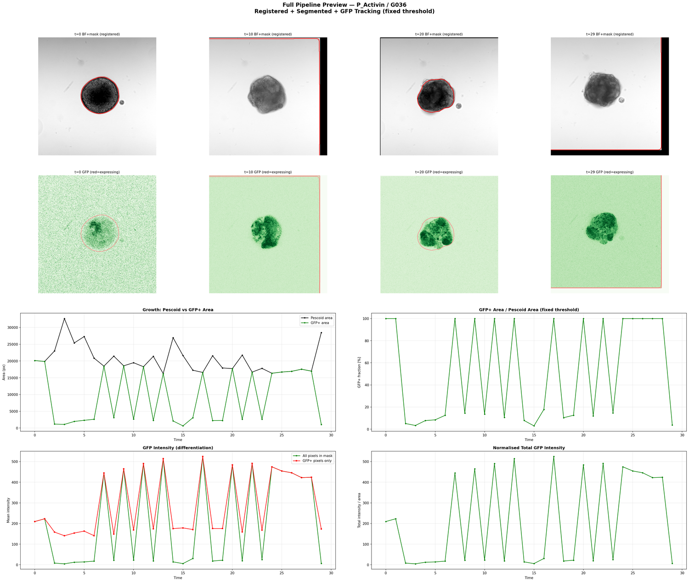

*One Activin pescoid from raw movie to results: registered and segmented brightfield (top),
mezzo-GFP tracking inside the mask (middle), and the growth, fraction, and intensity
read-outs (bottom).*

---

## Poster: movies, data, and analysis

This repository is the landing page for the EMBO poster **"Chemical perturbation
induces multipolarity in zebrafish pescoids"** (Kattimani, Marschlich, Trivedi —
Trivedi Lab, EMBL Barcelona). The poster QR code points here.

- **Time-lapse movies (AVI)** — representative pescoids, mezzo-GFP / brightfield:
  [Google Drive folder](https://drive.google.com/drive/folders/1WoiYh0df0wQkdqNCWdH2azFrWizXkHex?usp=sharing)
- **Analysis pipeline and methods** — see [How each step is carried out](#how-each-step-is-carried-out)
  below, with a full per-script reference in [`HOW_TO_RUN.md`](HOW_TO_RUN.md).
- **Population analyses** (phenotype, pole sequence/spacing, cortical coherence,
  dose response) — the staged workflow in [`phase1/`](phase1) … [`phase5/`](phase5).
- **Contact** — megha.kattimani@embl.es

---

## What it does

Give it a time-lapse and for every pescoid you get:

- A clean segmentation mask in each frame (deep-learning U-Net, no hand-tuning per movie)
- Frames registered and rotated so the pescoid sits still and points the same way
- Shape over time: area, perimeter, aspect ratio, circularity, solidity, eccentricity
- Mezzo-GFP expression over time: positive area, fraction, mean and total intensity
- A perimeter kymograph that shows where the outline pushes out or pulls in
- Pole detection and pole shape (how many poles, where, how long, how wide)
- Phenotype calls per pescoid: monopolar, bipolar, or multipolar
- Cross-condition comparison plots once a whole experiment is processed

---

## How each step is carried out

The analysis runs in phases. The first part is a per-pescoid engine
([`main_analysis.py`](main_analysis.py)) that does the heavy image work. The later phases
take those results and answer the biology questions across a whole experiment. You can run
the engine on its own, or run the phases in order on a full dataset.

Each step below has three parts: what it gives you, how it is actually done in the code,
and an example of the result pulled straight from an output folder.

### Step 1: Load and Z-project

**What:** turn a raw 5D stack (T, Z, C, Y, X) into one clean 2D frame per timepoint and
channel.

**How:** for each timepoint we take the chosen channel and collapse the Z dimension. The
default is a best-focus projection for brightfield; the GFP channel uses a max projection so
no fluorescence is lost. The result is normalised by clipping to the 0.5 and 99.5 percentiles
and rescaling to a 0 to 1 range, with an optional inversion for brightfield so the dark
pescoid reads bright. See `preprocess_frame` and `load_timelapse` in `main_analysis.py`.

### Step 2: Segmentation

**What:** a binary mask of the pescoid in every frame.

**How:** each brightfield frame goes through a U-Net (4 levels, features 32/64/128/256, about
7.8 M parameters) trained on hand-drawn pescoid masks. The network outputs a probability map,
which is thresholded at 0.5. We then clean it up: fill holes, close with a 3-pixel disk, fill
holes again, and keep only the largest connected component. Finally a temporal pass throws out
frames whose area is below 10 percent of the movie median (segmentation noise) and refills them
from the nearest good frame, so a few bad frames never break a trajectory.

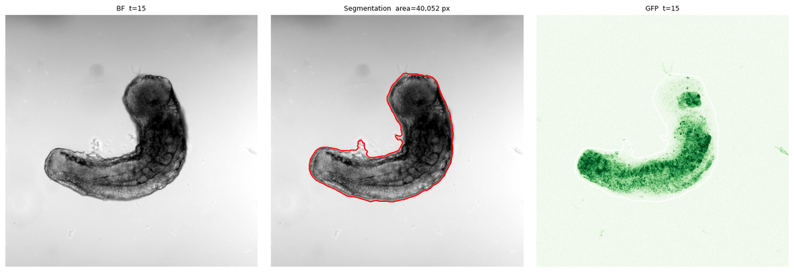

*Left to right: raw brightfield, the U-Net mask outline in red, and the matching mezzo-GFP
channel. This is a late, strongly elongated frame.*

### Step 3: Registration and centering

**What:** remove drift and tumbling so the only motion left is real shape change.

**How:** for each frame we fit an ellipse to the mask and read off the major-axis orientation.
A single affine transform then rotates the frame so that axis is horizontal and shifts the
centroid to the image center, all on a padded canvas so nothing is ever cropped. Masks are
warped with nearest-neighbour, intensity images with linear interpolation. The total rotation
that had to be corrected is logged per sample. See `compute_orientation`, `rotate_centered`,
and `align_timeseries`.

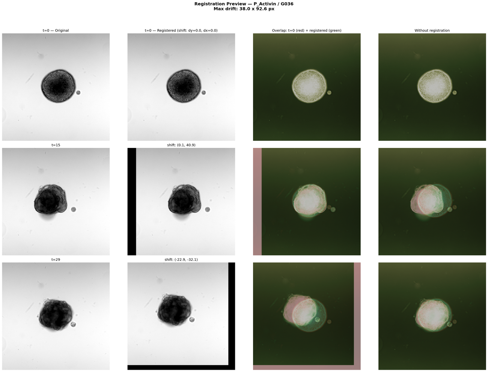

*Raw frames (left columns) versus registered frames, with red/green overlays showing how
much drift was removed.*

### Step 4: Morphology over time

**What:** the shape numbers, one row per frame.

**How:** `skimage.measure.regionprops` on the largest region gives area, perimeter, the fitted
ellipse major and minor axes, solidity, and eccentricity. Aspect ratio is major over minor, and
circularity is `4 * pi * area / perimeter^2`. Everything is written to
`morphology_over_time.csv`.

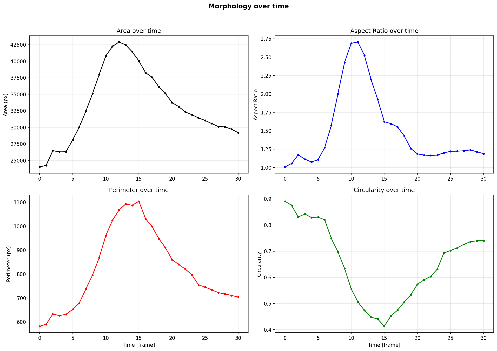

Example from `morphology_over_time.csv` (one Activin pescoid, first frames):

| time | area | aspect_ratio | circularity | solidity |
|---|---|---|---|---|
| 0 | 24027 | 1.009 | 0.891 | 0.992 |
| 1 | 24267 | 1.056 | 0.876 | 0.989 |
| 2 | 26486 | 1.173 | 0.831 | 0.986 |

*It starts almost circular (AR near 1), peaks near AR 2.7 mid-movie, then relaxes back to
about 1.19 by the end.*

### Step 5: Mezzo-GFP expression

**What:** how much of the fate marker is on, and how bright, over time.

**How:** the GFP channel is blurred (Gaussian, sigma 3) and thresholded inside the brightfield
mask. The threshold is computed once, from the brightest frame in the movie, and then held
fixed, so early frames with no signal correctly read near zero instead of floating up. Positive
regions smaller than 500 pixels (about 20 microns) are dropped. From there we record positive
area, fraction of the mask that is positive, and mean, total, and max intensity into
`mezzo_expression_over_time.csv`.

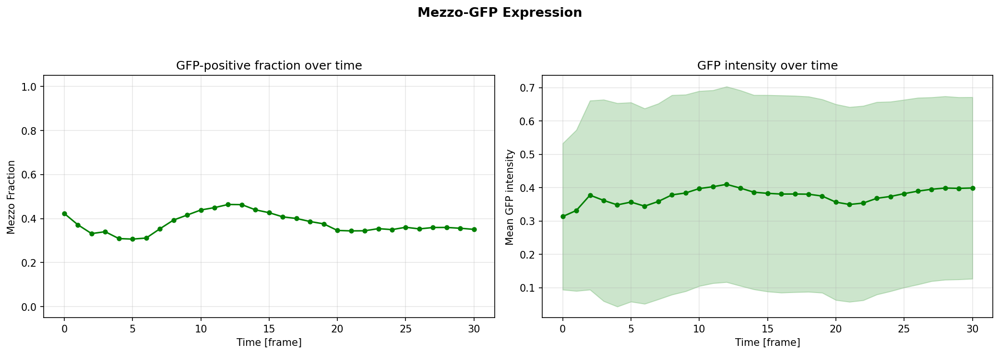

*GFP-positive fraction and mean intensity through the movie for the same pescoid (mean
fraction about 0.38).*

### Step 6: Perimeter kymograph

**What:** a single picture of where and when the boundary moves.

**How:** from the first frame we sample the outline at fixed angles around the centroid. In
every later frame we cast a ray out along each of those angles until it leaves the mask, which
gives the radius at that angular position. Subtracting the first-frame baseline and normalising
by the largest change gives a value from -1 to 1 per position per frame. Red is outward motion,
blue is inward. See `radii_along_angles` and `build_kymograph`.

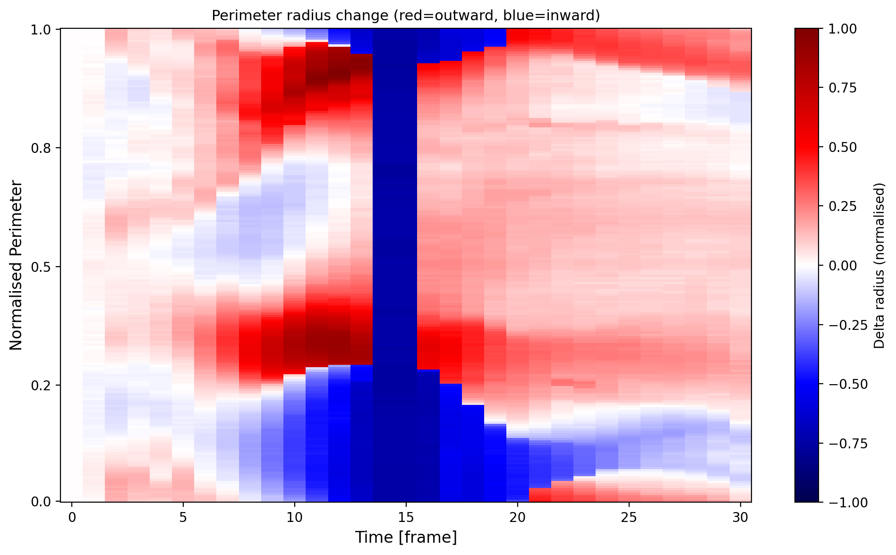

*Perimeter position on the y axis, time on the x axis. The strong red bands are where the
boundary pushed out and stayed out, which is what a pole looks like.*

### Step 7: Pole detection and pole shape

**What:** how many poles, where they are, and how big they are.

**How:** we time-average the absolute kymograph into a single activity profile along the
perimeter, smooth it, and run peak detection (`scipy.signal.find_peaks`, prominence 0.12,
minimum spacing 25 positions). Each peak is a pole, classed outward or inward by the sign of its
average radial displacement. For every pole we then walk back to the mask and measure a wedge
from the centroid: pole length (centroid to the farthest pixel), arc width, angular extent, and
area. Results go to `pole_counts.csv` and `pole_dimensions.csv`.

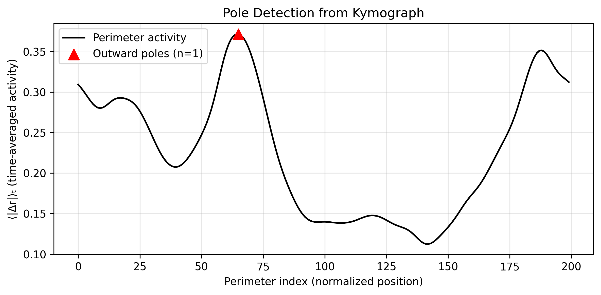

Example from `pole_counts.csv`:

```
metric,value
total_poles,1
outward_poles,1
inward_poles,0
```

*This pescoid forms a single clean outward pole, visible as the red marker on the activity
profile.*

### Cross-condition summary

Run a whole experiment folder and every sample is rolled up into `batch_summary.csv`, then
turned into condition-level comparison plots automatically.

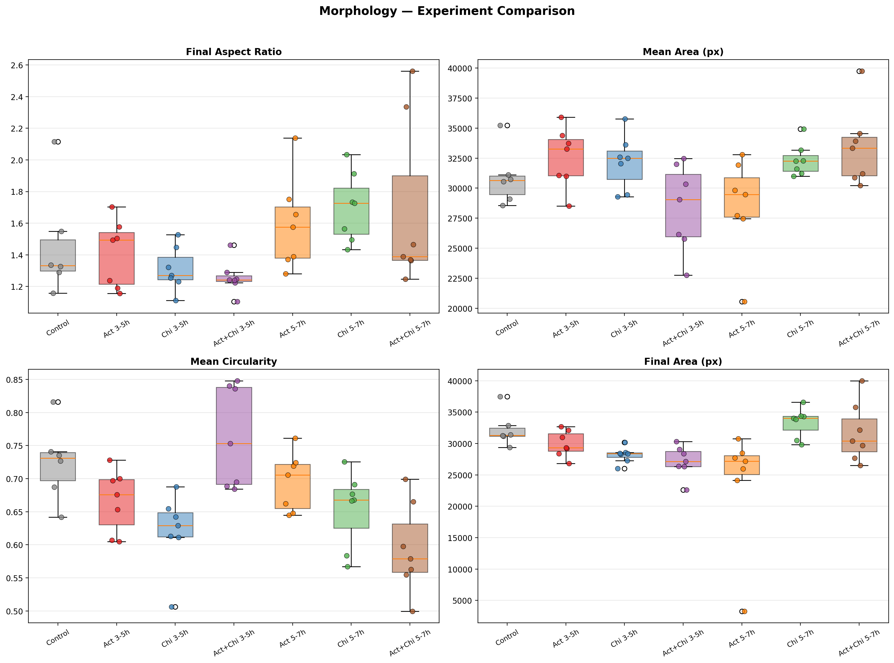

Example rows from `batch_summary.csv`:

| file | condition | mean_aspect_ratio | mean_mezzo_fraction | n_poles |
|---|---|---|---|---|
| G013 | Act | 1.50 | 0.377 | 1 |
| G014 | Act | 1.43 | 0.272 | 1 |
| G015 | Act | 1.86 | 0.284 | 1 |

---

## The study phases (run across a whole experiment)

Once the engine has processed every pescoid, the phase scripts do the population-level
biology. They are named so you run them in order.

| Phase | Script(s) | What it does and how |
|---|---|---|
| **1. QC** | `phase1_qc.py`, `phase1_h2a_qc.py`, `phase1_titration_qc.py` | Segment, register, and center every pescoid; save aligned BF / GFP / LynTom (or H2A) stacks for the later phases |
| **2. Poles** | `phase2_poles.py`, `phase2_h2a_poles.py`, `phase2_titration_poles.py` | Track mezzo poles (GFP clusters) and morph poles (outline curvature) in parallel, flag the two as coordinated when their centroids sit within a set distance, and call each pescoid monopolar, bipolar, or multipolar |
| **3. Phenotype plots** | `phase3_plots.py`, `phase3_phenotype_pie.py`, `phase3_titration_doseresponse.py` | Phenotype fractions by condition, pole counts, dose response, and a pooled phenotype donut |
| **4. Tissue tension** | `phase4_tension.py`, `phase4b_analysis.py` | Compute structure-tensor coherence on the LynTom membrane signal, then compare mechanics inside the mezzo poles against the rest of the pescoid, and test the pole-pole geometry |
| **5. Nuclei, flow, mechanism** | `phase5*` | AP-axis kymographs, pole morphometrics, nuclear segmentation (StarDist) and tracking (btrack), mitosis detection, convergence and divergence from PIV (openpiv), and what predicts multipolarity, plus poster and gallery figures |

The titration and H2A variants share the same logic with dataset-specific tweaks (channel
order, scene-to-condition mapping, acquisition timing, and a fine-tuned U-Net for the
near-white titration backgrounds, see `phase1_titration_finetune_unet.py`).

### Setting up a dataset: which TIFF is which population

The populations (embryo control `E_ctrl`, pescoid control `P_ctrl`, pescoid treated
`P_Activin`, and the dose groups) are assigned at the top of the Phase 1 script, in one of
two ways depending on how the microscope saved the data.

**Option A: one folder per condition** (Lyn_mezzo, `phase1_qc.py`). The raw data already sits
in named subfolders, and the script reads each one:

```
DATA_ROOT/
  E_ctrl/              *.tif
  E_Activin_3-5hpf/    *.tif
  P_ctrl/              *.tif
  P_Activin_3-5hpf/    *.tif
```
```python
CONDITIONS = ["E_ctrl", "E_Activin_3-5hpf", "P_ctrl", "P_Activin_3-5hpf"]
```

Point `DATA_ROOT` at the parent folder and list your condition folder names in `CONDITIONS`.

**Option B: one big folder of scenes, mapped by number** (mezzo-H2A `phase1_h2a_qc.py`,
titration `phase1_titration_qc.py`). Every scene is one TIFF named with `#N` (for example
`..._#23.tif`), and a small function maps scene numbers to populations. This is where you
set the numbers. The H2A dataset uses contiguous blocks:

```python
def scene_condition(scene_num):
    if 1  <= scene_num <= 10:  return "E_ctrl"            # embryos
    if 11 <= scene_num <= 22:  return "P_ctrl"            # pescoid control
    if 23 <= scene_num <= 50:  return "P_Activin_3-5hpf"  # pescoid treated
    return None                                           # skip anything else
```

The titration uses explicit per-dose lists (the doses were interleaved on the plate), plus a
set of failed scenes to drop:

```python
SCENE_GROUPS = {
    "E":       [5, 6, 7, 8, 9, 10, 11, 12, 13],
    "Pctrl":   [1, 3, 14, 15, 16, 17, 18, 19, 20],
    "P10ngml": [21, 22, 23, 24, 25, 26, 51, 52, 53, 54, 55, 56],
    "P30ngml": [27, 28, 29, 30, 31, 32, 33, 34, 35, 36, 37],
    "P50ngml": [38, 39, 40, 41, 42, 43, 44, 45, 46, 47, 48, 49, 50, 57, 58, 59, 60],
}
EXCLUDE_SCENES = {3, 14, 15, 30, 32, 33, 34, 35, 41, 46, 48, 49, 50, 52, 56, 57}
```

So to run on a new acquisition, edit three things at the top of the Phase 1 script:

1. `DATA_ROOT` and `OUT`: where the TIFFs are, and where results should go.
2. The population assignment: either the `CONDITIONS` folder names (Option A), or the scene
   ranges in `scene_condition` and `SCENE_GROUPS` (Option B), matching how you saved the
   scenes. Files that map to `None` are skipped.
3. The channel order and timing for that microscope, for example:
   ```python
   CH_GFP = 0; CH_H2A = 1; CH_BF = 2     # channel positions in the (T,Z,C,Y,X) stack
   HPF_START = 7.0                        # hours post fertilisation at frame 0
   HPF_INTERVAL = 698.83 / 3600.0         # time between frames, in hours
   ```

Embryo (`E_*`) scenes are kept only for staging and QC; the pescoid analyses use the `P_*`
populations.

### Phase 2 and 3: phenotype calls

The pole tracks from Phase 2 let every pescoid be sorted by how many mezzo poles it forms.
Activin pushes pescoids strongly toward bipolar and multipolar, while controls mostly stay
diffuse or monopolar.

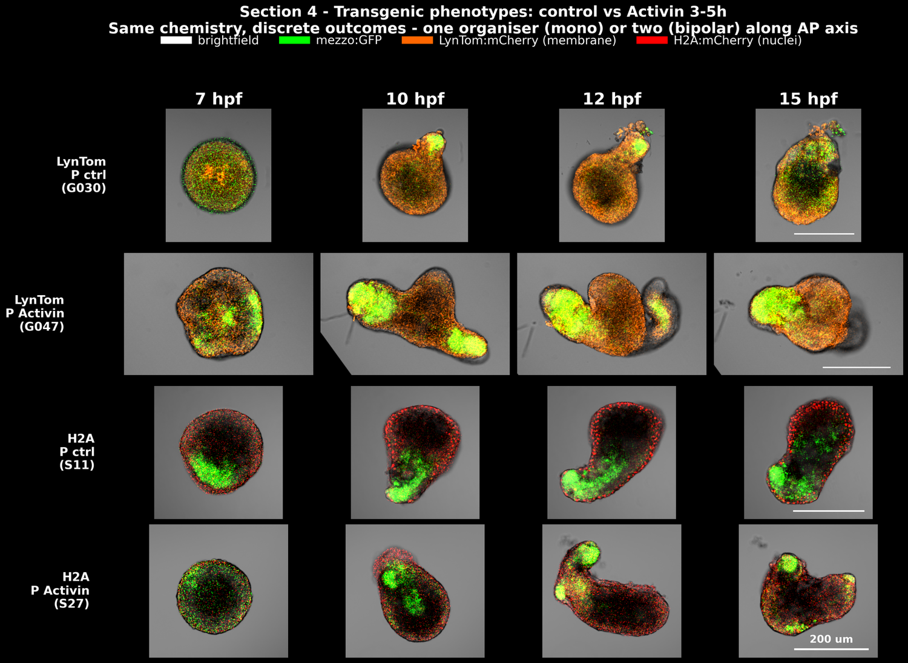

*Same chemistry, different outcomes. Controls form at most one organiser; Activin pescoids
elongate and form two or more poles along the AP axis (brightfield, mezzo-GFP, LynTom
membrane, H2A nuclei).*

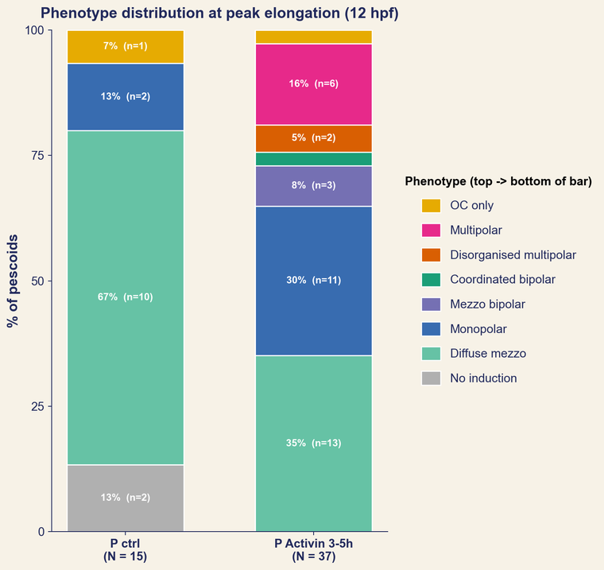
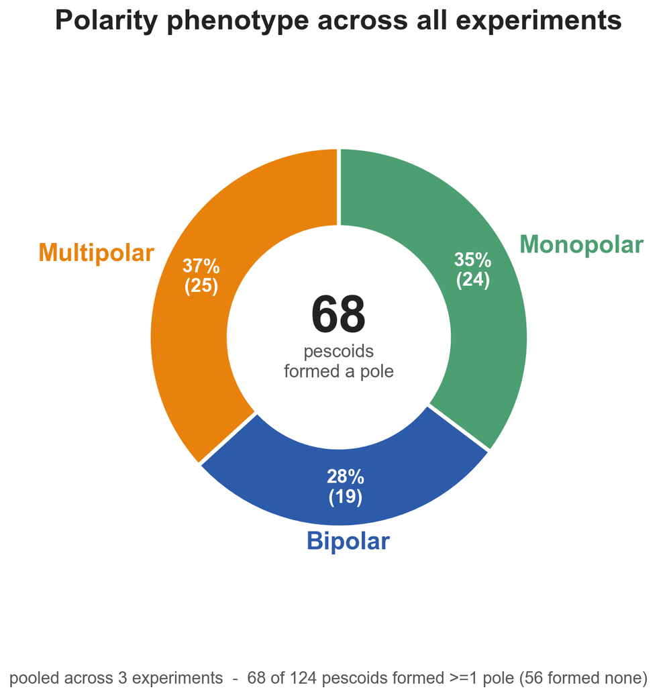

*Left: phenotype fractions for control versus Activin at peak elongation. Right: pooled across
all three experiments, 68 of 124 pescoids formed at least one pole (35 percent monopolar, 28
percent bipolar, 37 percent multipolar).*

### Phase 4: membrane texture order (interpret with care)

Run `phase4_tension.py` (start with `--sanity` for a quick two-pescoid check, then the full
set). It works on the LynTom membrane channel that Phase 1 aligned:

1. For every frame it builds a structure tensor: smooth image gradients with a Gaussian, then
   smooth the gradient products again, and from the two eigenvalues per pixel read off a local
   orientation and a coherence value, `(lam1 - lam2) / (lam1 + lam2)`, where 0 is isotropic and
   1 is perfectly aligned. See `structure_tensor_fields`. This coherence is purely spatial and
   computed one frame at a time; it is not a frame-to-frame motion measurement (that is the PIV
   flow in Phase 5).
2. It summarises each pescoid with a coherence-weighted nematic order parameter Q (overall
   alignment, 0 to 1), compares a 15-pixel cortex band against the eroded interior, and takes a
   radial coherence profile from center to edge.
3. Using the Phase 2 pole tracks it picks the peak frame and measures coherence inside the
   mezzo-pole regions versus the rest of the mask.

**A caveat worth stating plainly.** The LynTom image is a max-Z projection over the full
12 to 13 slice stack, from the outer EVL epithelium down to the deep cells. Those layers are
very different (the EVL is a flat, aligned sheet; deep cells are rounded and disordered), so a
single coherence number per pixel mixes them, and the rim-versus-core difference largely
reflects this layered architecture and the viewing geometry rather than a clean mechanical
tension. The number is reproducible, but read it as "membrane texture order," not as a direct
tension readout. The like-for-like, same-frame comparisons (inside versus outside a pole, and
future pole site versus random) are sturdier than the absolute cortex-versus-interior value,
and the Phase 5 PIV flow is the more direct mechanical measure.

`phase4b_analysis.py` follows up: coherence stratified by phenotype, whether future pole sites
already look different before the pole appears (cause versus consequence), and the angle
between poles in bipolar and multipolar pescoids (testing for a roughly 180 degree,
head-to-tail layout).

### Phase 5: nuclei, flow, tracking, and mechanism

Phase 5 is a set of focused follow-ups, each its own script. The tools below are the ones that
actually held up on this data:

- **Nuclear segmentation, StarDist** (`phase5a_v2_segment.py`). The first pass used Cellpose
  on the H2A channel, but it missed nuclei when the H2A signal was faint. The working approach
  is StarDist 2D (`versatile_fluo`) on difference-of-Gaussians enhanced H2A, restricted to
  inside the brightfield mask. This recovered the faint nuclei and produced the instance label
  stacks everything downstream relies on.
- **Tracking, btrack** (`phase5b2_tracking_v2.py`). Bayesian multi-object tracking runs on the
  StarDist nuclei masks for every pescoid with enough nuclei (at least 30 in the 12 to 16 hpf
  window). It gives per-cell tracks with parent and lineage, then track duration, displacement,
  and residence time inside the mezzo poles.
- **Mitosis, from btrack lineage** (`phase5b3_mitosis.py`). Divisions are read off track
  branching (a parent track ending and two child tracks starting together nearby), tagged by
  time, position, and whether they sit inside a pole.
- **Tissue flow, openpiv** (`phase5a_h2a_dynamics.py`, `phase5b1_divergence.py`). PIV between
  consecutive H2A frames gives a velocity field, and from it the divergence (convergence sinks
  versus expansion) and curl per frame.

These feed the mechanism analysis (`phase5c_multipolar_mechanism.py`), which asks whether the
multipolar outcome is already set before the poles appear, by lining up the early flow and
nuclear measurements against the final pole count.

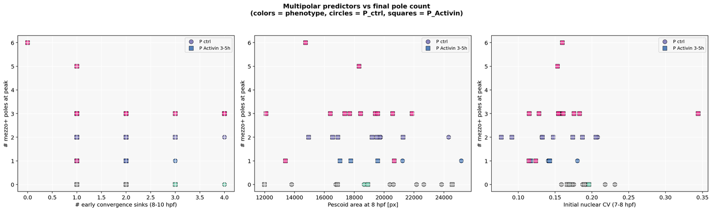

*Final mezzo-pole count at peak against three early predictors (convergence sinks at 8 to 10
hpf, pescoid area at 8 hpf, and initial nuclear variability). Controls (circles) stay low,
Activin pescoids (squares) spread up to six poles.*

---

## Mechanobiology at the poles: the evidence

The central biological claim is that a mezzo pole is not just a patch of fate marker, it is a
mechanically and structurally distinct piece of tissue. Three independent measurements support
this, and one rules out a trivial explanation. The worked example below is G047, a bipolar
Activin pescoid (anterior bare bulge plus two posterior mezzo-GFP poles), with the
population numbers alongside.

### 1. The pole is less ordered than the rest of the pescoid

Per-region cortical coherence over time, for the same pescoid, splitting the anterior bulge,
the primary (persistent) pole, the secondary (transient) pole, and the body core:

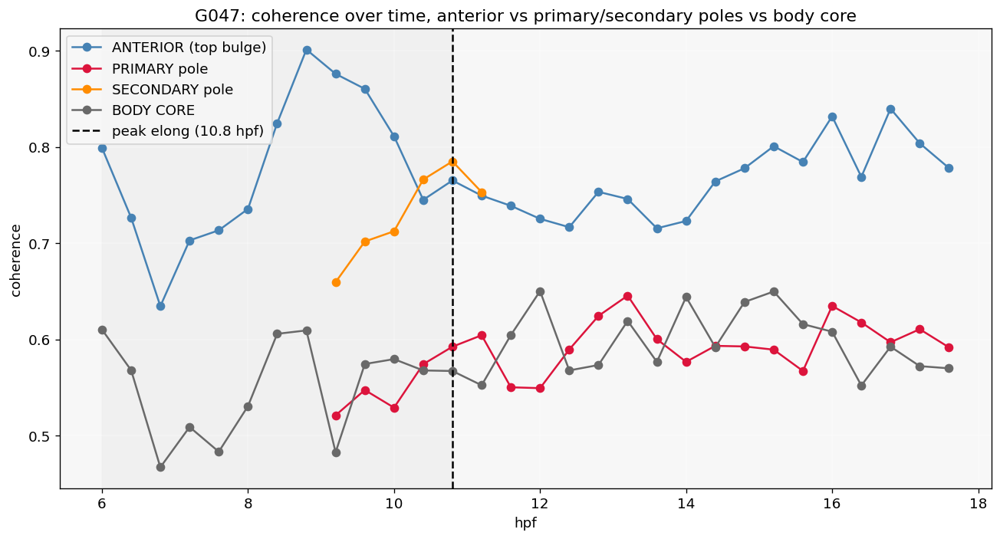

*The primary pole sits low (about 0.59), continuous with the disordered body core. The bare
anterior bulge stays high (about 0.77), and the short-lived secondary pole is high like the
anterior until it disappears around 11 hpf. So the persistent, dominant mezzo pole is the
disordered one; the bare anterior and the transient pole stay ordered.*

Along the axis to each pole, coherence falls and mezzo-GFP rises toward both pole tips:

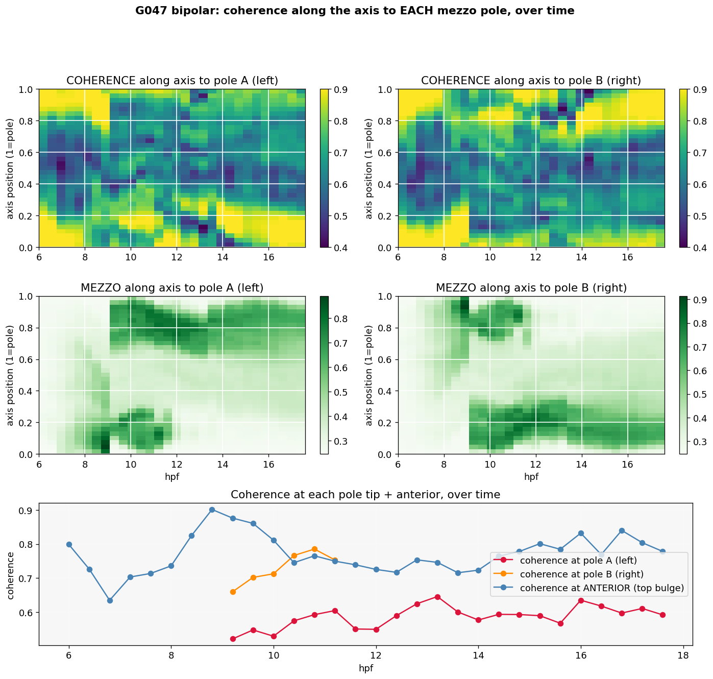

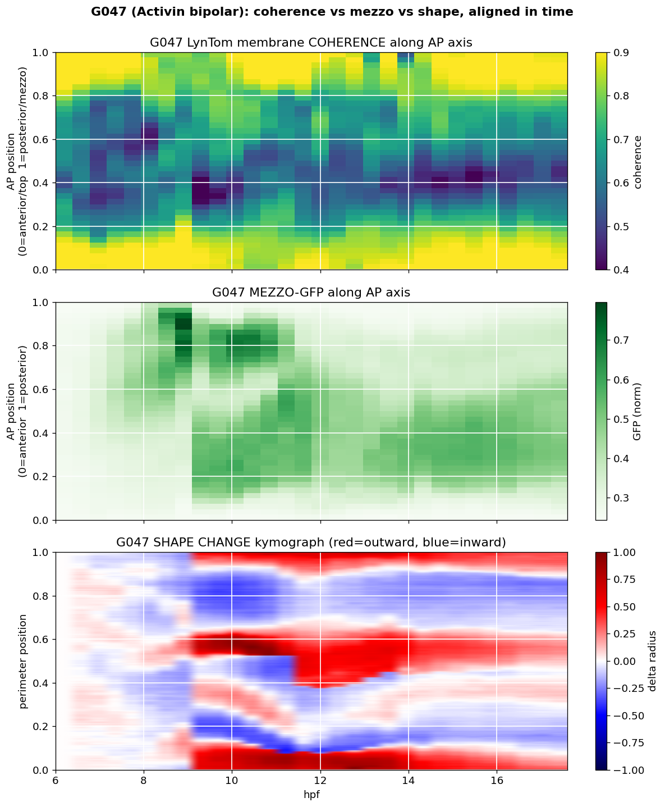

*Coherence (top), mezzo-GFP (middle), and shape change (bottom) on a shared time axis. Where
and when the mezzo builds at the posterior, the coherence dips and the boundary pushes out.*

The same signal resolves along the body (AP) axis, and it is not unique to G047. Inside the
mezzo pole the cortex stays less ordered than the opposite end of the axis throughout, in a
monopolar (G046), a bipolar (G047), and a control (G030) pescoid:

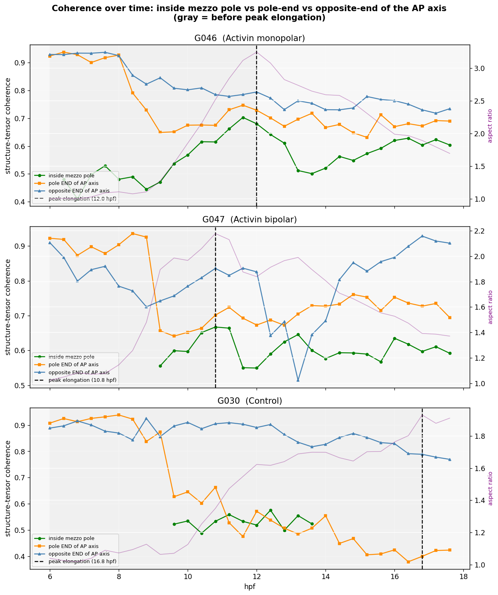

*Coherence over time inside the mezzo pole (green) versus the pole-end (orange) and opposite-end
(blue) of the AP axis. The mezzo pole stays below the opposite end across all three pole
phenotypes.*

Splitting each bipolar pescoid into anterior, primary pole, secondary pole, and body core gives
the same ordering in every one checked:

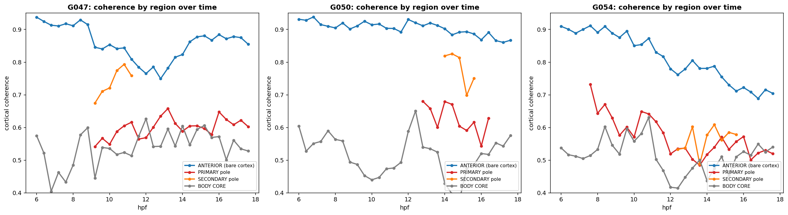

*Three bipolar Activin pescoids (G047, G050, G054). In every one the bare anterior cortex is the
most ordered (0.81 to 0.90) and the body core plus the persistent primary mezzo pole are the
least ordered (0.51 to 0.63). The secondary pole is variable (ordered in G047 and G050,
disordered in G054), so only the anterior-ordered, primary-disordered contrast is claimed as
general.*

### 2. It holds across the population, in both conditions

Defining the mezzo region from the actual GFP signal (not pole labels), across all 51 pescoids:

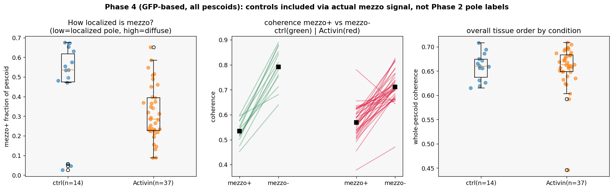

*Mezzo-GFP positive tissue is less coherent than mezzo-negative tissue in 50 of 51 pescoids
(controls 14/14, Activin 36/37). It holds in both conditions, so it tracks mezzo identity, not
the Activin treatment. After matching for distance from the edge the effect survives at about
-0.12 in 49 of 51 (p approximately 3e-9), so it is not the rim-to-core gradient.*

### 3. It is not an imaging artifact of the max-Z projection

The coherence is similar across the 12 to 13 Z slices, so it is not one bright EVL slice
driving the result (Activin G047 versus control G030):

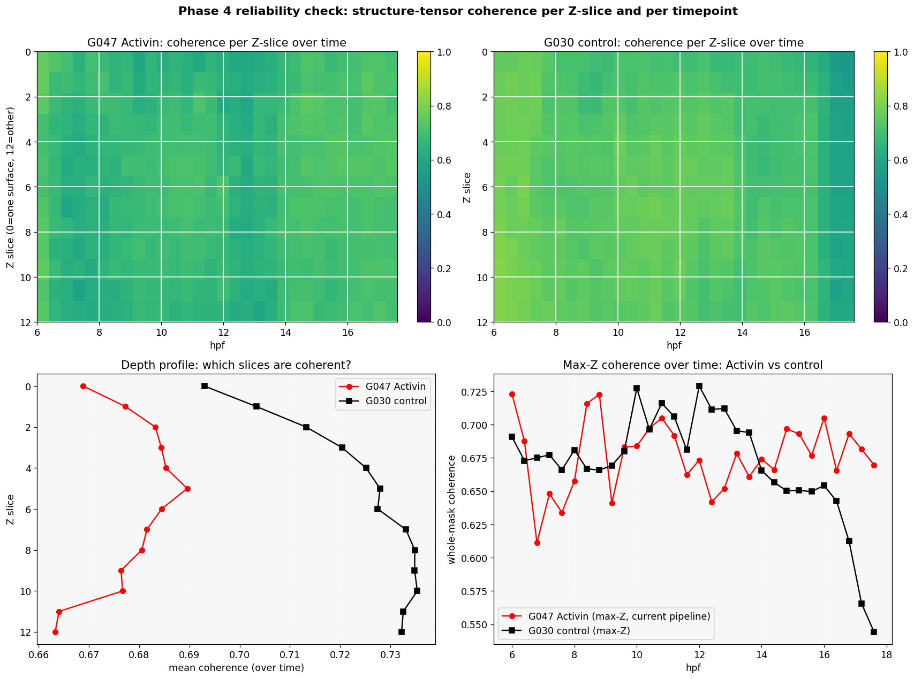

*Coherence per Z slice over time (top), the depth profile (bottom left), and the max-Z value
over time (bottom right). The signal is consistent through depth, not a surface-layer artifact.*

### 4. Cells converge into the poles, but the poles are not simply denser or faster

From the H2A nuclei, PIV flow gives a velocity field, and its divergence separates convergence
sinks (negative) from expansion (positive):

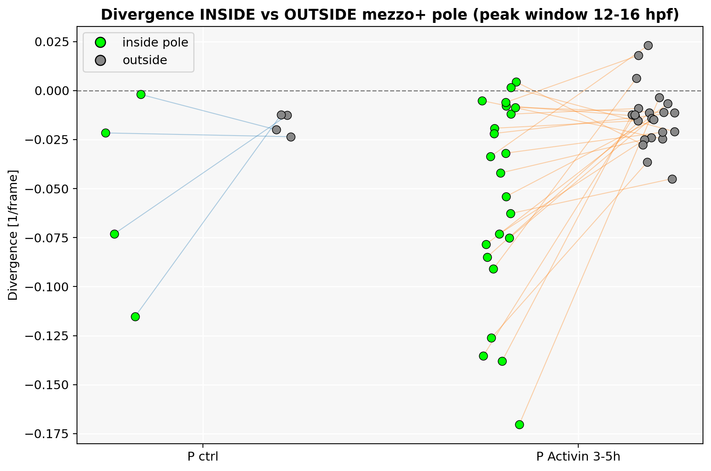

*Inside mezzo+ poles the divergence is consistently negative (cells converging inward); outside
sits near zero. Poles are convergence sinks.*

Two controls show the coherence and convergence differences are not a trivial accumulation
effect. Flow magnitude and nuclear density inside versus outside the pole are mixed, with no
clean separation:

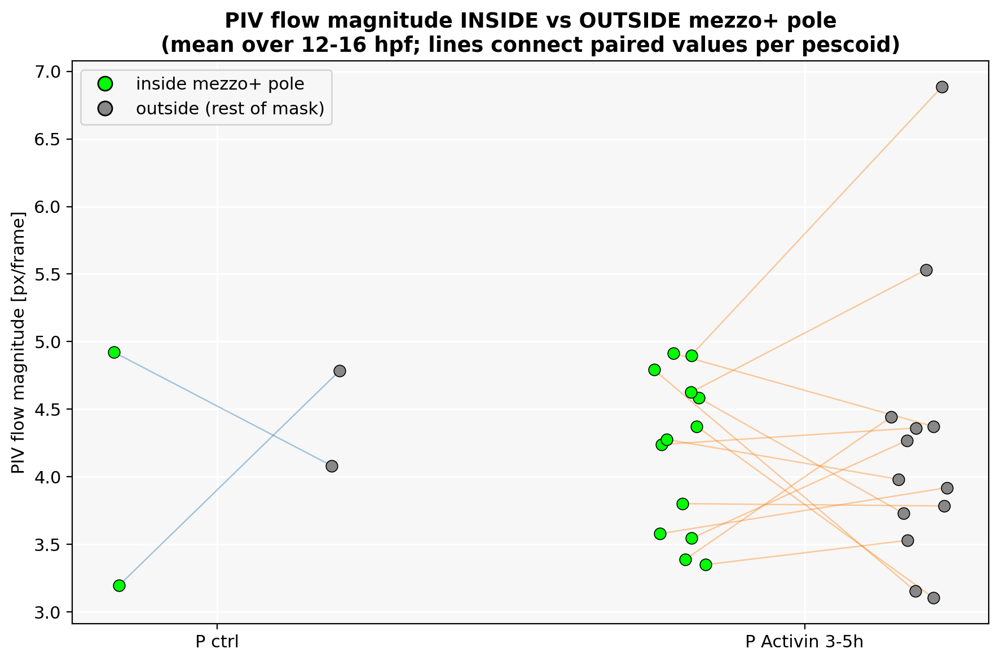
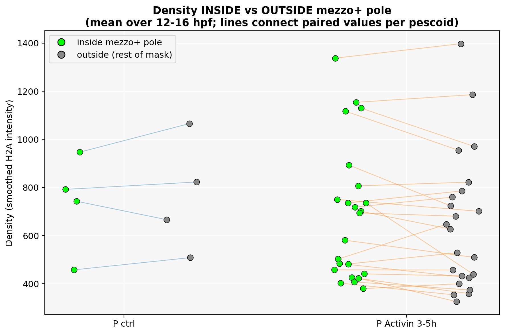

*Poles are not simply faster (left) or denser (right). So the less-ordered, converging pole is
a genuine reorganisation, not just more cells crammed into one place.*

**Reading it together.** The mezzo pole is less epithelially ordered (membrane coherence) and
is an active convergence sink (nuclear flow divergence), and this is not explained by the pole
being merely denser or faster. The honest caveats still stand: coherence is membrane texture
order from a max-Z projection, the G047 time courses are a single pescoid (the population
numbers are the evidence), and a direct mechanical or junctional readout is the next step. Full
write-up in [`docs/phase4_findings.md`](docs/phase4_findings.md).

---

## Segmentation: why U-Net

Before settling on a segmenter I benchmarked four tools against the same 18 hand-drawn
ground-truth masks. U-Net came out on top, with Cellpose very close behind.

| Tool | IoU | Dice | Notes |
|---|---|---|---|
| **3D U-Net** | **0.948** | **0.973** | Chosen. 7.8 M parameters, runs on CPU or GPU |
| Cellpose | 0.945 | 0.972 | Excellent, near-tie on accuracy |
| MOrgAna | 0.882 | 0.937 | Good recall, looser boundaries |
| Ilastik | 0.803 | 0.842 | Most variable across images |

Benchmark code and full per-image tables are in
[`benchmarking_segment_tools/`](benchmarking_segment_tools/).

---

## Scale and speed

How much it chews through and how fast (measured on a laptop CPU, single thread, 512x512
frames; a CUDA GPU is several times faster):

- **Segmentation:** about 0.24 s per frame, roughly 4 frames per second
- **One pescoid** (around 31 frames): segmentation in about 7 seconds, and the full
  per-sample chain (segment, register, morphology, GFP, kymograph, poles) in well under a
  minute
- **A full experiment** in the reference run: 7 conditions, about 48 pescoids, around 31
  frames each, so roughly 1,500 frames processed start to finish in a few minutes
- The Lyn_mezzo study covered around 52 pescoids (P_ctrl plus P_Activin), and the
  titration covered 58 scenes across 5 dose groups

Skip the per-frame overlay PNGs with `--no-overlays` and it runs noticeably faster.

---

## Install

```bash
git clone https://github.com/Megha-Kattimani/pescoid-image-analysis
cd pescoid-image-analysis
python -m venv venv
# Windows:  venv\Scripts\activate
# macOS/Linux:  source venv/bin/activate
pip install -r requirements.txt
```

Core stack: numpy, scipy, scikit-image, pandas, tifffile, matplotlib, torch.
The Phase 5 nuclear work uses stardist (nuclei), btrack (tracking), and openpiv (flow); see
`requirements.txt`. Trained U-Net weights are not in git because of their size; drop them
into `annotation_workspace/model/`.

---

## Quick start

```bash
# One sample or a whole condition folder, GPU on, fluorescence in channel 0
python main_analysis.py "path/to/data" --out analysis_output/ --gpu \
    --bf-channel 1 --gfp-channel 0 --gfp-threshold yen

# Faster: skip the per-frame overlay images
python main_analysis.py "path/to/data" --out analysis_output/ --gpu --no-overlays

# See every flag
python main_analysis.py --help
```

For the full per-script reference (every flag, every output column), see
[`HOW_TO_RUN.md`](HOW_TO_RUN.md).

---

## What you get per pescoid

```
<output>/<sample>/
  morphology_over_time.csv         area, AR, perimeter, circularity, solidity, eccentricity
  mezzo_expression_over_time.csv   GFP positive area, fraction, mean/total intensity, threshold
  kymograph_matrix.npy             raw perimeter delta-radius matrix
  pole_counts.csv                  total, outward, inward poles
  pole_dimensions.csv              per-pole length, width, angular extent, area
  summary.json                     one record per sample
  masks/<sample>_masks.tif         segmentation masks over time
  plots/                           morphology, mezzo, kymograph, pole-detection figures
  overlays/<sample>_tNNNN.png      per-frame BF / mask / GFP / GFP-positive panels
```

Run a whole folder and you also get `batch_summary.csv` and condition-level comparison
plots.

---

## Repository layout

```
pescoid-image-analysis/
  main_analysis.py            per-pescoid engine (segment, register, measure)
  config.py                   default parameters
  analysis/                   core modules: segmentation, pole detection, tissue tension
  benchmarking_segment_tools/ U-Net vs Cellpose vs MOrgAna vs Ilastik comparison
  scripts/                    preprocessing and training helpers
  pescoid_3d/                 packaged 3D / regionalization modules
  phase1/ ... phase5/         the staged study workflow (run in order)
  other_analyses/             study-specific plots, comparisons, and tension maps
  docs/images/                example outputs used in this README
  HOW_TO_RUN.md               full per-script reference
  requirements.txt
```

Each phase script lives in its matching folder, for example `phase1/phase1_qc.py` or
`phase5/phase5c_multipolar_mechanism.py`. The cross-cutting plotting and comparison scripts
are in `other_analyses/`. Run them from the repo root (for example
`python phase1/phase1_qc.py --all`); they add the root to the path themselves.

---

## Notes worth knowing

- Output is in pixels. The Fiji/R reference analysis is in microns at about 1.78 um/px, so
  multiply by 1.78 to compare.
- Pescoid medium (L15 plus Phenol Red) gives a brighter background than embryo medium, so
  the refactored analysis subtracts a per-frame background measured outside the mask.
- Embryo (`E_*`) conditions are only for staging and QC, not for pescoid analysis.
- Registration is rotation plus centering on a padded canvas, so no edges are ever cropped.
  Turn it off with `--no-alignment`.

---

## Author

**Megha Kattimani**
Indian Institute of Science (IISc), Bengaluru, and Trivedi Lab, EMBL Barcelona.
